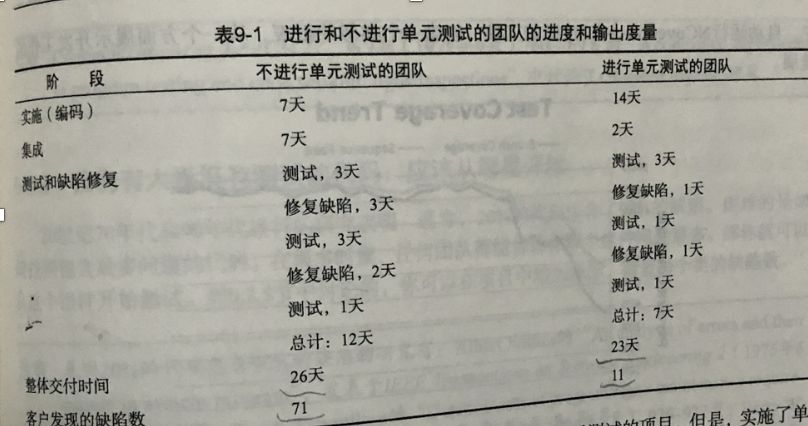
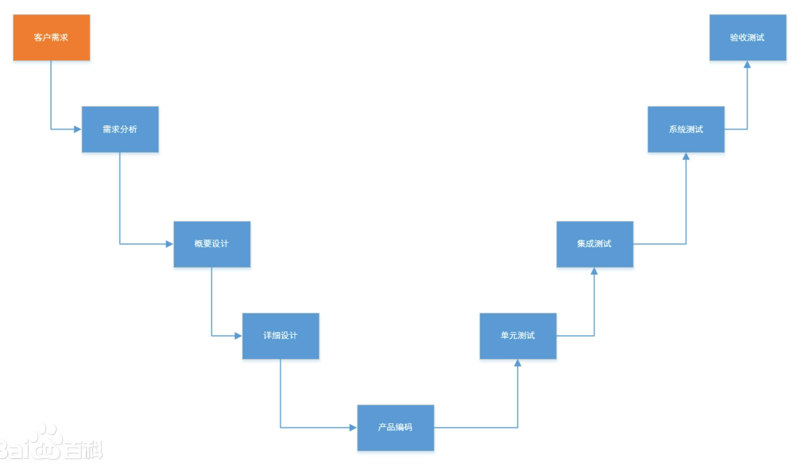

# Spock单元测试框架分享

## 1、背景简介

目前，公司的一些业务系统代码中，普遍缺少单元测试这一块，根据公司的安排，	仓库这块的系统，下面有计划要加上必要的单元测试，因为单元测试对软件开发很重要。我们小组近期对单元测试的这块进行了调研和实践，发现Spock很好用，所以才有机会在这里对单元测试框架Spock做一次总结和分享。

- 目标

  > 通过本次分享，让大家快速认识Spock，掌握基础和细节，并可以写大部分类型的单元测试代码；
  >
  > 给大家整理并留下一些官方的学习资料，以及其他人总结的经验博客；
  >
  > 最终目标：每个人都掌握使用 Spock 来编写单元测试代码

## 2、关于单元测试

据我了解，可能大多数程序员，平时不经常主动去写单元测试代码，而且可能会吐槽说：写单元测试很浪费时间，又没有什么显而易见的成效。那我们为什么还要写单元测试呢？

#### 2.1、为什么要进行单元测试

平时我们写代码，免不了要进行一些测试，如果没有使用单元测试，手动测试的方式有很多种，对于简单的程序，我们可以写一个main方法，调式查看指定的方法是否符合预期；对于一个服务系统，我们可以使用PostMan等工具来模拟一下真实请求，查看输入输出是否符合预期。无论那种测试，都有他的关注点，比如测试功能是否完备和正确，性能是否符合要求等。

以上测试方法有哪些问题？

- 很难覆盖所有业务逻辑代码，而且无法统计覆盖率

- 无法自动化重复测试，每次都需要人工调用，或者依赖外部工具

- 如果测试的功能依赖过多其他模块或者依赖外部系统，而正好依赖的部分还没有准备好怎么办？

- 对于代码中的大多数Bug问题，单元测试阶段是最容易被发现的，如果没有进行单元测试，那么后期发现这些Bug的周期会越来越长，修复的成本越来越高。

  ......

单纯的面对手动测试中这样或者那样的问题，是否就是我们使用单元测试的动力呢？

大家应该有意无意间听到过这样的吐槽：

- *写单元测试太浪费时间了，增加程序员的工作量*

- *我写代码很严谨，水平很高，我是不是可以不进行单元测试？*

- *我把测试都写了，那么测试人员做什么呢？*

  ......

不可否认，写单元测试确实会占用编码的时间，甚至有些情况下写单元测试的时间会比写业务逻辑代码的时间还要长。

但是：

- 单元测试保证测试的高覆盖率

  > 单元测试是所有测试中最底层的一类测试，是第一个环节，也是最重要的一个环节，是唯一一次可以实现代码覆盖率达到100%的测试环节，覆盖率代表了绝大多数数Bug会在这里被发现。

- 单元测试可以降低软件开发的成本

  > 来自微软的统计数据：bug在单元测试阶段被发现，平均耗时3.25小时，如果漏到系统测试阶段，要花费11.5小时。而且85%的缺陷都在代码设计阶段产生，而发现bug的阶段越靠后，耗费成本就越高，指数级别的增高。

- 单元测试可以自动化地重复进行测试

  > 这在代码重构时很重要，因为代码重构可能会难免涉及到代码的改动，导致代码逻辑可能和最终需求不一致的问题，但是如果有自动化且可以快速的重复进行测试，并发现问题，将会大大提高重构代码的安全性。

- 提升代码质量，规范代码

  > 想要写出更容易测试的业务代码，需要在满足业务需求的基础上，合理的设计代码结构和规范。，换句话说，单元测试促进了代码质量的提高。

一个案例：

来自《单元测试的艺术》这本书提到一个案例：找了开发能力相近的两个团队，同时开发相近的需求。进行单测的团队在编码阶段时长增长了一倍，从7天到14天，但是，这个团队在集成测试阶段的表现非常顺畅，bug量小，定位bug迅速等。换句话说，看似单元测试会占用编码时间，但是一旦从一个完整的需求交付周期来看，编码阶段的投入，换来了集成测试阶段的顺畅，且整体看来，交付总时间是减少的。



如上图的案例最终的效果，整体交付时间和缺陷数，均是单元测试团队最少。

> 缺陷数大大减少，意味着什么呢？
>
> - 程序员改Bug的时间会减少
> - 整个团队为一个Bug付出的沟通成本会减少
> - 用户的体验会更好

既然单元测试有很多优点，那么到底什么是单元测试呢？

#### 2.2、什么是单元测试

从软件开发周期的时间维度看，除了单元测试还有那些测试，我在网上找到一个软件开发中一个方法论模型——[V模型](https://baike.baidu.com/item/V%E6%A8%A1%E5%9E%8B/4518408?fr=aladdin)



这个模型中说到了各种各样的测试，这里不讨论每一种测试的具体概念，只观察一下单元测试在其中的位置，位于产品编码的后面，位于其他测试的前面，相当于最底层的和最先进行的测试环节，举个例子来理解这个阶段进行单元测试的意义：螺丝钉与飞机的故事——没有完备的单元测试的代码所构成的系统，就像组装一架飞机，但各个零部件出厂时并没有经过严格检验，只在会后组装好以后，通过试飞来检验飞机质量一样，结果只能是冒着极大的坠毁风险。尽管软件开发不会“坠毁”，但是严重的问题如果不尽量在早期发现并解决的话，影响线上使用效率甚至影响产品的客户流失，其损失同样不亚于飞机的坠毁。

这个例子主要说明，单元测试的是：通过软件开发早期对整个系统的最小可测试单元（比如具体某个方法）的正确性检测，从而将低软件开发的整体风险和成本的一种工作。以下是比较正式的定义：

> **单元测试**（英语：Unit Testing）又称为**模块测试**，是针对[程序模块](https://link.juejin.cn?target=https%3A%2F%2Fzh.wikipedia.org%2Fwiki%2F%E6%A8%A1%E7%B5%84_(%E7%A8%8B%E5%BC%8F%E8%A8%AD%E8%A8%88))（[软件设计](https://link.juejin.cn?target=https%3A%2F%2Fzh.wikipedia.org%2Fwiki%2F%E8%BD%AF%E4%BB%B6%E8%AE%BE%E8%AE%A1)的最小单位）来进行正确性检验的测试工作。程序单元是应用的最小可测试部件。在[过程化编程](https://link.juejin.cn?target=https%3A%2F%2Fzh.wikipedia.org%2Fwiki%2F%E9%81%8E%E7%A8%8B%E5%8C%96%E7%B7%A8%E7%A8%8B)中，一个单元就是单个程序、函数、过程等；对于面向对象编程，最小单元就是方法，包括基类（超类）、抽象类、或者派生类（子类）中的方法。
>
> ——摘自维基百科

网上也有人根据经验来说，广义的讲，单元可以理解成一个相对的概念，单元的定义取决于自己所处的开发语言环境。如果正在使用函数式编程，一个单元最有可能指的是一个函数。你的单元测试将使用不同的参数调用这个函数，并断言它返回了期待的结果；在面向对象语言里，从一个单一的方法到一整个的类都可以是一个单元，单元测试可以使用不同的测试用例来测试这个方法或者类的行为是否符合预期。

## 3、测试框架

#### 3.1、Spock是什么？和JUnit、jMock有什么区别？

Spock是一款国外优秀的测试框架，基于[BDD](https://en.wikipedia.org/wiki/Behavior-driven_development)（行为驱动开发）思想实现，功能非常强大。Spock结合Groovy动态语言的特点，提供了各种标签，并采用简单、通用、结构化的描述语言，让编写测试代码更加简洁、高效。

其他一些框架，比如JUnit、jMock、Mockito都是相对独立的工具，只是针对不同的业务场景提供特定的解决方案。其中JUnit单纯用于测试，并不提供Mock功能。尽管jMock、Mockito提供了Mock功能，可以把接口等依赖屏蔽掉，但不能对静态方法Mock。要想进行静态方法的Mock，需要使用PowerMock、jMockit。这些独立的框架之间也需要配合才能适用实际的测试场景，并且语法上比较繁琐，没有固定且有效的规范可寻。工具多了就会导致不同的人写出的单元测试代码“五花八门”，风格相差较大。相对Spock来说是不易管理和维护的。

#### 3.2、Spock的优势

Spock之所以能够在众多测试框架中脱颖而出，是因为Spock与其他框架相比，具有以下优势

- 使用Groovy这种动态语言来编写测试代码，可以让我们编写的测试代码更简洁，适合敏捷开发，提高编写单元测试代码的效率。

  > [Groovy](https://link.jianshu.com?t=http://www.groovy-lang.org/) 是 Apache 旗下的一门基于 JVM 平台的动态/敏捷编程语言，在语言的设计上它吸纳了 Python、Ruby 和 Smalltalk 语言的优秀特性，语法非常简练和优美，开发效率也非常高。并且，Groovy 可以与 Java 语言无缝对接，在写 Groovy 的时候如果忘记了语法可以直接按Java的语法继续写，也可以在 Java 中调用 Groovy 脚本，都可以很好的工作(这是因为Groovy源码文件最终也会被编译成符合JAVA class规范的.class文件，在JVM中运行)，这有效的降低了 Java 开发者学习 Groovy 的成本。

- 规范化测试代码，内置多种标签来规范单元测试代码的语义，测试代码结构清晰，更具可读性，降低后期管理和维护难度。

  >  内置标签比如：`given`、`and`、`when`、`then`、`expect`、`where`……帮助我们应对复杂的测试场景。

- 自带Mock功能。

  > Mock的英文本意是“模拟的，虚假的”，顾名思义，在软件开发的单元测试中，它的作用是模拟一些接口依赖，方便测试方法可以顺利执行。

- 遵从[BDD](https://en.wikipedia.org/wiki/Behavior-driven_development)（行为驱动开发）模式，有助于提升代码的质量。

  > TDD：Test-driven development （测试驱动开发）
  >
  > BDD：Behavior-Driven Development (行为驱动开发)

了解了Spock的这些特点，接下来详细介绍一下Spock的使用


## 4、Spock入门

#### 4.1、引入包

```xml
<!-- 在 Spring boot 环境使用Spock 需要以下依赖-->

    <!-- Spring boot 自己的测试模块依赖-->
    <dependency>
      <groupId>org.springframework.boot</groupId>
      <artifactId>spring-boot-starter-test</artifactId>
      <scope>test</scope>
    </dependency>
    <!-- 使用 Spock 必须的依赖：spock 的核心依赖-->
    <dependency>
      <groupId>org.spockframework</groupId>
      <artifactId>spock-core</artifactId>
      <version>1.2-groovy-2.4</version>
      <scope>test</scope>
    </dependency>
    <!-- 使用 Spock 必须的依赖：groovy 库-->
    <dependency>
      <groupId>org.codehaus.groovy</groupId>
      <artifactId>groovy-all</artifactId>
      <version>2.4.15</version>
    </dependency>
    <!-- spock 与 spring 环境的集成 -->
    <dependency>
      <groupId>org.spockframework</groupId>
      <artifactId>spock-spring</artifactId>
      <version>1.2-groovy-2.4</version>
      <scope>test</scope>
    </dependency>
```

#### 4.2、Specification（规范）

使用Spock框架，每个测试类都需要直接或者间接继承自Specification

```groovy
/**
 * 使用Spock框架，每个测试类都需要直接或者间接继承自Specification。
 * Specification英文原意是：规格；规范；明细单；说明书
 * 可见Spock的测试类在命名语义上就显现出很强的规范约束。
 * 测试类中的内容，大体上是符合下面注释的结构(次序无关)
 * @author hudongkang
 * @date 2021-09-06 15:04
 */
class MyFirstSpecification extends Specification {
  // 属性
  // 属性
  //...
  // 测试方法
  // 测试方法
  //...
  // 辅助方法
  // 辅助方法
  // ....
}
```

#### 4.3、Fields（属性）

和Java的全局属性的概念是一样的。对于测试场景，最好在声明属性时就进行初始化（对于没有加@Shared注解的属性或者不是静态属性，声明时进行初始化，从语义上讲，等同于在setup()方法中初始化它们。）默认时属性对象不会再各个测试方法之间共享，换句话说，每一个测试方法运行时，都引用着不同的实例（如果测试方法中有引用的话），这有助于将测试方法彼此隔离。

但有的时候，需要在测试方法之间共享一个属性实例的话，可以在属性上添加@Shared注解，同样最好再属性声明时便初始化好（对于加有@Shared注解的属性，声明时初始化，从语义上来说，等同于在setupSpec()方法中初始化属性）


#### 4.4、Fixture Methods（固定方法）

Fixture 方法的作用，是在测试方法执行前后，做一些数据准备和数据清理工作的。

Fixture 方法在测试代码中不是必须的，而且有等效方案：

- 对于没有加@Shared注解的属性或者不是静态属性，如果在声明时就进行初始化，从语义上讲，等同于在setup()方法中初始化它们。

- 对于加有@Shared注解的属性或者是静态属性，如果在声明时就初始化，从语义上来说，等同于在setupSpec()方法中初始化属性

但是如果初始化逻辑比较复杂，无法在声明属性时进行初始化，那么 Fixture 方法就显得很有用了。

```java
    /**
     * 全局前置方法：在本类中所有测试方法执行之前执行
     * 只有加上 @Shared 或者静态属性可以在这个方法中引用
     * 如果存在子类覆盖父类的 setupSpec()，那么父类的先于子类的执行
     */
    def setupSpec() {
        //执行一些本类中所有测试方法共享的全局数据的初始化工作，比如共享属性数据或静态属性的初始化
        //执行本方法的时机：本类中所有测试方法执行之前，且一共执行一次
    }
    /**
     * 前置方法：在每一个测试方法之前都会执行
     * 如果存在子类覆盖父类的 setup()，那么父类的先于子类的执行
     *
     */
    def setup() {
        // 执行一些非共享数据的初始化工作，每个测试方法执行前都需要执行一次，
        // 执行的结果，提供给接下来即将执行的测试方法使用
    }
    /**
     * 后置方法：在每一个测试方法之后都会执行
     * 如果存在子类覆盖父类的 cleanup()，那么子类的先于父类的执行
     */
    def cleanup() {
        // 执行一些非共享数据的清理工作，每个测试方法执行过后都需要执行一次
        // 清理完必要的数据，防止污染到下一个测试方法，配合setup()方法，可以做到测试方法之间是完全相互隔离的
    }
    /**
     * 全局后置方法：在最后一个测试方法之后执行
     * 只有加上 @Shared 或者静态属性可以在这个方法中引用
     * 如果存在子类覆盖父类的 cleanupSpec()，那么子类的先于父类的执行
     */
    def cleanupSpec() {
        //执行一些本类中所有测试方法共享的全局数据的清理工作，比如共享属性数据或静态属性的初始化
        //执行本方法的时机：本类中所有测试方法执行完后，且一共执行一次
    }

```

#### 4.5、Feature Methods（特征方法）

Spock官方命名直译过来，叫特性方法。其实就是我们平时写的测试方法(本文中统一叫测试方法)。

```groovy
    /**
     * 测试方法的方法名可以是字符串，方便测试者为这个测试起一个更好理解的名字
     * 方法体中必须使用Spock提供的标签来约束一些代码行为，这也是Spock对测试代码规范化的提现
     */
    def "测试一个加法逻辑" (){

        given: "给定以下数据"
        def i = 5
        def j = 6

        when: "执行需要测试的逻辑"
        def s = studySpockService.sum(i,j)

        then: "预期结果"
        assert s == 11
    }
```

测试方法是单元测试的核心，其他所有的特性都是为了能够写出更好的测试方法代码服务。从理论上讲，测试方法由四个阶段组成：

- 1、环境准备：初始化测试数据和环境
- 2、调用执行：对要测试的某个单元进行调用触发
- 3、预期响应：描述系统预期的响应
- 4、清理重置：清理本次测试方法用到的数据和环境

第一阶段和最后一个阶段是可选的，但是中间两个阶段是始终存在的。（非隔离的具有交互的测试方法除外）

#### 4.6、Blocks（块）

由于测试方法在Spock的理论设计中，被分为四个阶段，这也是符合单元测试的普遍逻辑的，但是如何约束所有的程序员来遵循这种规范呢？针对这个问题，Spock提供了内置的标签支持。每一个标签约束了一个所谓的代码块。对于测试方法开头到第一个标签之间，如果存在代码，则这部分代码属于一个隐式块。测试方法中至少要有一个显示标签（Spock如何识别一个方法是否是测试方法或者是别的什么方法，依据就是方法中是否存在Spock内置的标签）。每个标签可以添加一个字符串描述信息，方便对代码块的阅读。

##### 4.6.1、Given 标签

```groovy
given: "给定以下数据"
def i = 5
def j = 6
```

这个块中可以做一些局部变量的设置工作，或者可以写其他任何代码，Given块并不会约束允许写什么不允许写什么，只是从规范的角度触发建议写“局部数据的初始化”工作。这个标签可以省略不写，但是一旦写了，Given 块之前不能有其他显式标签块（可以有隐式块），Given 块也不可以重复出现。在需要的时候一般是建议写上Given标签，这样会让代码显得更加易读。

##### 4.6.2、When 和 Then 标签

```groovy
when: "执行需要测试的逻辑"
def s = studySpockService.sum(i,j)

then: "预期结果"
assert s == 11
```

When 和 Then 标签总是成对出现的，不可以只用When而不用Then或者只用Then而不用When；他们本别对应代表了测试方法中四阶段的中间两个阶段：调用执行和预期响应。

一个测试方法中可以包含多对 When 和 Then 标签。

When标签代码块可以编写任意代码，然而Then标签代码块只允许写：“Conditions（条件）”、“Exception Conditions（异常条件）”、“Interactions（交互）”和变量定义。

- Conditions（条件）

  > 条件就是一个可以产生布尔值的表达式，条件是描述预期的状态，很想JUnit中的断言，不同的是这里的条件不需要断言关键字。

  ```groovy
  when: "执行一行代码"
  stack.push(elem)
  
  then: "预期执行后会发生什么，即条件（布尔表达式）"
  !stack.empty
  stack.size() == 1
  stack.peek() == elem
  //上面可以写多个条件，单最好是5个以下，如果比较多的话，要考虑代码是否可以优化
  //如果有多个条件的话，所有条件均为True时，测试才会认为通过
  ```

- Exception Conditions（异常条件）

  > 异常条件用于处理调用执行环节的被测试方法返回是void类型的情况。这时可以在Then标签代码块中预期被测试方法是否会抛出异常，以及异常的种类，异常内部的消息等。

  ```groovy
  when: "空栈做弹出测试"
  stack.pop()
  
  then: "预期会抛出异常，且栈为空"
  thrown(EmptyStackException)
  stack.empty
  
  
  when: "空栈做弹出测试"
  stack.pop()
  
  then: "预期会抛出EmptyStackException异常，且异常中的属性cause == null"
  def e = thrown(EmptyStackException)
  e.cause == null
  
  when: "空栈做弹出测试"
  stack.pop()
  
  then: "预期会抛出EmptyStackException异常，且异常中的属性cause == null"
  EmptyStackException e = thrown()//和上面的是两种写法，作用相同
  e.cause == null
  ```

  > 如果预期不会抛出任何异常呢，比如往Map中放一个Key为null的数据

  ```groovy
  def "HashMap accepts null key"() {
    given: "给定一个Map"
    def map = new HashMap()
  
    when: "当执行往Map中放一个Key为null的数据时"
    map.put(null, "elem")
  
    then: "预期结果不会抛出NullPointerException异常"
    notThrown(NullPointerException)
  }
  ```

- Interactions（交互）

  > 有这样一种场景：假如系统中有一个以观察者模式写的代码，想要测试：事件多播器是否成功的广播事件，以及监听者是否接收到事件以及接收事件到的次数。

  ```groovy
  def "events are published to all subscribers"() {
    given: "初始化消费者和生产者"
    def listener1 = Mock(Listener)
    def listener2 = Mock(Listener)
    def multicaster = new EventMulticaster()
    multicaster.add(listener1)
    multicaster.add(listener2)
  
    when:
    multicaster.fire("event")
  
    then:
    1 * listener1.receive("event")
    1 * listener2.receive("event")
  }
  ```

##### 4.6.3、Expect 标签

有些情况下，When 和 Then 标签会显得比较啰嗦，比如：

```groovy
when: "执行取最大逻辑"
def x = Math.max(1, 2)

then: "预期最大值为2"
x == 2
```

对于上面的情况，Expect 标签会显得更加自然：

```groovy
expect: "期望1和2的最大值为2"
Math.max(1, 2) == 2
```

大部分情况，Expect 标签是简化后的When 和 Then 标签，且Expect 标签适合简单的场景，When 和 Then 标签更适合相对复杂的场景。

特例：Expect 标签块中不允许有交互条件。有交互条件的时候，只能用When 和 Then 标签。

##### 4.6.4、Cleanup 标签块

- cleanup标签不可以再一个测试方法中重复出现
- cleanup标签的后面如果有其他标签，只允许跟where标签块
- cleanup标签中的代码一定会执行，类似finally代码块的作用。主要用来主动释放一些测试方法中用到的资源

> 总结助手：
>
> cleanup标签和given标签，只是解决测试方法内部的数据资源问题，不影响其他测试方法；
>
> cleanup() 方法和setup() 方法，是解决所有测试方法共同使用到的数据资源问题，对于所有测试方法或者大多数测试方法会用到的数据初始化和清理工作，可以放在cleanup() 方法和setup() 方法中，提升代码复用率。

##### 4.6.5、Where 标签块

where标签块总是在一个测试方法的最后一个出现，并且不允许重复出现。where标签块用于编写数据驱动的测试方法，举例来说：

```groovy
def "在两个数之间比较出最大的数"() {
  expect: "执行逻辑，并期望条件成立"
  Math.max(a, b) == c

  where: "分两次测试，第一次a=5,b=1,c=5;第二次a=3,b=9,c=9"
  a << [5, 3]
  b << [1, 9]
  c << [5, 9]
}

//where块中的形式也可以是下面这样更加易读的格式
def "在两个数之间比较出最大的数"() {
  expect: "执行逻辑，并期望条件成立"
  Math.max(a, b) == c

  where: "分两次测试，第一次a=5,b=1,c=5;第二次a=3,b=9,c=9"
  a | b | c
  5 | 1 | 5
  3 | 9 | 9
}
```

上面的例子中，where标签块的作用，是将同一个测试分成不同测试用例版本，依次使用不同的输入输出数据进行测试。

#### 4.7、辅助方法

辅助方法就是一个普通的方法，可以用来分解比较复杂的测试代码。当测试代码很多而且复杂时，可以抽离出一些代码封装到辅助方法中，然后在测试方法中调用辅助方法。

辅助方法的用途之一是封装 "期望Conditions（条件）" ，可以用一个例子来说明：

```groovy
def "检验一个电脑的配置"() {
  when: "执行购买电脑方法，返回一个电脑实例"
  def pc = shop.buyPc()

  then: "期望条件"
  pc.vendor == "Sunny"
  pc.clockRate >= 2333
  pc.ram >= 4096
  pc.os == "Linux"
}
```

这个例子的代码是没有问题的，但是在期望部分，对PC实例的多个属性进行了条件断言，辅助方法可以将这些期望统一封装到一个地方：

```groovy
def "检验一个电脑的配置"() {
  when: "执行购买电脑方法，返回一个电脑实例"
  def pc = shop.buyPc()

  then: "期望条件"
  matchesPreferredConfiguration(pc)
}

/**
 * 将多个并列的断言统一放进一个“辅助方法”中
 * Groovy中方法中的return语句是可以省略的
 * 可以看到，辅助方法中多个期望改写成了一个 大的布尔表达式，并将最终的布尔结果返回
 */
def matchesPreferredConfiguration(pc) {
  pc.vendor == "Sunny"
  && pc.clockRate >= 2333
  && pc.ram >= 4096
  && pc.os == "Linux"
}

//执行测试后，可能的运行结果：
matchesPreferredConfiguration(pc)
|                             |
false                         ...

//上面的测试结果，虽然没有符合预期，但是具体却不知道哪里（哪一条具体的期望条件）出了问题。
//其实辅助方法在用于封装条件断言时，可以改进一下：
//1、将辅助方法的返回类型改为void
//2、将隐式条件，改为显示条件
//（加上assert关键字的条件就是显示条件，默认不加assert关键字的条件是隐式条件）
void matchesPreferredConfiguration(pc) {
  assert pc.vendor == "Sunny"
  assert pc.clockRate >= 2333
  assert pc.ram >= 4096
  assert pc.os == "Linux"
}
//在辅助方法中，将隐式条件改为显示条件的好处，是可以更清晰具体的反应测试结果：
assert pc.clockRate >= 2333
       |  |         |
       |  1666      false
       ...
```

#### 4.8、使用 with() 方法来封装期望

上面提到可以使用辅助方法来封装期望，期望Spock也内置了期望的封装方法：with()

还是上面的例子，可以写成：

```groovy
def "检验一个电脑的配置"() {
  when: "执行购买电脑方法，返回一个电脑实例"
  def pc = shop.buyPc()

  
  then: "期望条件"
  with(pc) {
    vendor == "Sunny"
    clockRate >= 2333
    ram >= 406
    os == "Linux"
  }
}
```

with()方法中的第一个条件不成立时，整个测试认为不通过，并结束后面条件的检验，话句话说，测试结果中，只罗列第一个失败的条件信息，那么如果有多个条件失败，想一次性知道全部失败的条件的信息怎么办，Spock提供了一种软断言的方式。

#### 4.9、软断言：verifyAll()

还是上面的例子，使用软断言：

```groovy
def "检验一个电脑的配置"() {
  when: "执行购买电脑方法，返回一个电脑实例"
  def pc = shop.buyPc()

  then: "期望条件"
  verifyAll(pc) {
    vendor == "Sunny"
    clockRate >= 2333
    ram >= 406
    os == "Linux"
  }
}
```

这样测试结果中回显示出所有失败的条件信息。

#### 4.10、关于数据驱动

上面将where标签块的时候，提到过一次数据驱动。

数据驱动测试，是通过where标签块中维护一个表格形式的数据块，官方成为Data Tables（数据表格），迭代这个数据表格，依次重复的执行该测试方法，来达到测试不同用例的目的。

```groovy
def "测试示例"() {
        expect:
        Math.max(a, b) == c

        where:
        a | b | c
        1 | 3 | 3
        7 | 4 | 6
        0 | 0 | 0
}
```

数据表格中的第一行是表头，表头的每一个元素相当于一个数据变量的声明，可以在测试方法中进行引用。这里的a、b、c就是三个变量声明。从第二行开始的每一行数据对应这测试方法的一次执行迭代，直到迭代完所有的行，最终测试结果中会显示所有迭代失败的结果信息。

每一次迭代之间的数据是相互隔离的，除非测试方法中引用了静态属性或者@Shared标记的属性。

where块中，只能访问静态属性或者@Shared标记的属性，一旦有这种引用，也意味着where块中引入了被其他测试方法共享的属性数据。目前Spock还做不到：只在一个测试方法的迭代之间共享数据而不和其他测试方法共享数据。换句话说，多次迭代的同一个测试方法，可以看成是一些列代码相同但数据不同的独立测试方法。

关于数据表格的表现形式，至少要有两个列，如果只用到一个列的话，可以这样写：

```groovy
where:
a | _
1 | _
7 | _
0 | _
```

还有时候，为了方便的分辨出哪一列是输入，哪一列是期望的输出，还可以将表格这样写：

```groovy
def "测试示例"() {
        expect:
        Math.max(a, b) == c

        where: "两个|线右边的列，是期望的输出"
        a | b | c
        1 | 3 | 3
        7 | 4 | 6
        0 | 0 | 0
}
```

#### 4.11、Reporting of Failures （故障报告）

```groovy
    def "测试示例"() {
        expect:
        Math.max(a, b) == c

        where:
        a | b || c
        1 | 3 || 3
        7 | 4 || 6
        0 | 0 || 0
    }

//一下是这次测试结果的故障报告：

Condition not satisfied:

Math.max(a, b) == c
     |   |  |  |  |
     7   7  4  |  6
               false
```

#### 4.12、Mock（模拟）

单元测试的含义在于测试一个单元，测试仅限于某个方法内部的代码。如果这写代码中依赖了外部的服务，或者其他人还未写好的接口，我们不能保证外部服务的可用性，也同样不能等另一个人写好接口后再测试，这是不现实的。Mock就是来解决这类问题的，相当于模拟被调用的外部对象的行为和数据，从而方便单元测试的顺利进行。

```groovy
//Mock模拟一个库存接口实例，两种写法
def stockService = Mock(StockService)
StockService stockService = Mock()

//匹配调用，并模拟返回数据
stockService.getStockNumb("abc") >> 100

//如果被测试的方法中，stockService.getStockNumb("abc")被调用了多次，可以这样写
//这表示，第一次调用会返回100，第二次调用会返回95
stockService.getStockNumb("abc") >> 100 >> 95
//或者这样写
stockService.getStockNumb("abc") >>> [100, 95]
//如果有第三次调用，且模拟第三次调用时抛出了异常。可以这样写，
stockService.getStockNumb("abc") >>> [100, 95] >> { throw new Exception() }

//有的时候，模拟对象的方法没有返回值，只关心被调用的次数
//那么可以用作期望的条件
then: "期望stockService.updateStock(sku,95)被调用了一次"
1 * stockService.updateStock(sku,95)

//有时候需要模拟当外部依赖发生异常时，被测试单元的反应是否符合预期，
//需要在调用外部依赖时故意制造一些异常
stockService.updateStock(sku,95) >> { throw new Exception() }

```

#### 4.13、测试 Controller 中的 http api

```groovy

/**
 * 描述：Spock 在 Spring Boog 环境下的测试
 *
 * @author hudongkang
 * @date 2021-09-07 18:28
 */
//指定要测试的Controller
//如果不写controllers属性，会尝试将所有扫描到的Controller都加载到Ioc容器中
@WebMvcTest(controllers = OrderController.class)
//激活测试配置
@ActiveProfiles("mvc")
//指定启动类，只在单元测试中使用的SpringBoot启动类
@ContextConfiguration(classes = MvcUnitTestApplication.class)
class OrderControllerTest extends Specification {
    /**
     * Spring官方提供
     * 用于测试 Contoller API
     * 无需手动注册Bean,会自动注入进来
     */
    @Autowired
    MockMvc mvc
    /**
     * 这是一个模拟对象实例的引用
     */
    @Autowired
    OrderService orderService
    
    def "测试一个简单的 Http API" () {
        expect: "controller是否可用"
        MvcResult mvcResult = mvc.perform(
                //构造请求
                MockMvcRequestBuilders.get("/spock/hello")
                //添加参数
                .param("name","张三")
        )
                //期望HTTP调用结果状态为200
                .andExpect(MockMvcResultMatchers.status().isOk())
                //打印格式化的结果报告，方便控制台查看
                .andDo(MockMvcResultHandlers.print())
                .andReturn()
        //打印返回的数据
        println(mvcResult.response.getContentAsString())
    }
    
    def "测试一个 Http API" () {
        given: ""
        orderService.createOrder(_,_) >> 95
        expect: "controller是否可用"
        MvcResult mvcResult = mvc.perform(
                //构造请求
                MockMvcRequestBuilders.get("/spock/getOrderNumb")
                        //添加参数
                        .param("sku","abc")
                        .param("goodsNumb", "5")
        )
                //期望HTTP调用结果状态为200
                .andExpect(MockMvcResultMatchers.status().isOk())
                //打印格式化的结果报告，方便控制台查看
                .andDo(MockMvcResultHandlers.print())
                .andReturn()
        //打印返回的数据
        println(mvcResult.response.getContentAsString())
        "{\"code\":\"ok\",\"msg\":null,\"result\":95}" == mvcResult.response.getContentAsString()
    }
    
    /**
     * 提供测试环境所需的配置
     */
    @TestConfiguration
    static class MockConfig {
        /**
         * 该工厂允许在Specification之外创建模拟，例如在 Spring 配置中。
         */
        def detachedMockFactory = new DetachedMockFactory()

        @Bean
        OrderService OrderService() {
            return detachedMockFactory.Mock(OrderService)
        }
    }
}
```

## 5、资料

- [官方文档 Spock Framework Reference Documentation](https://spockframework.org/spock/docs/2.0/all_in_one.html)
- [Spock单元测试框架介绍以及在美团优选的实践](https://tech.meituan.com/2021/08/06/spock-practice-in-meituan.html)

- [Groovy 教程](https://www.w3cschool.cn/groovy/)


